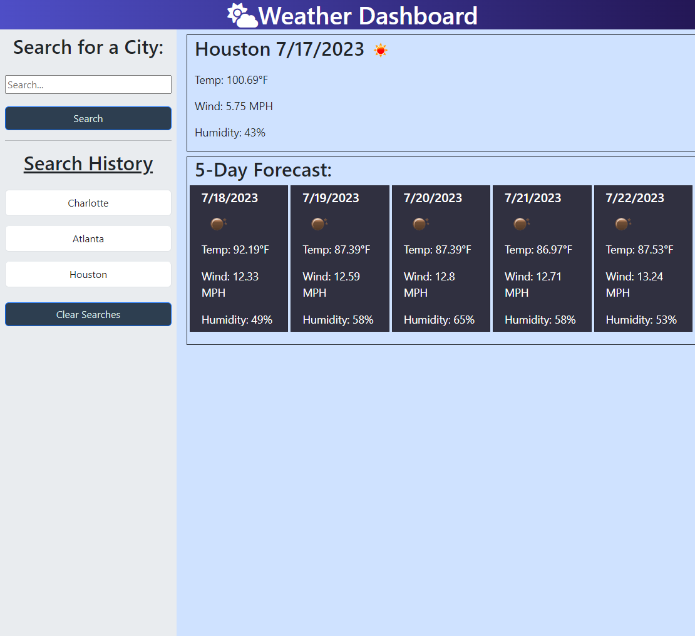

# Weather Dashboard


## Description

This is a weather dashboard created using openweathermap APIs. The APIs used are the Current and 5 day Forecast. When a user searches with a city name, then the current and future five day forecast conditions are displayed for that city. The city is then added to the search history. For each weather conditions displayed, the city name, date, icon of weather confition, temperature, humidity, and wind speed for both current weather and 5 day forecast. When a user clicks on a city from the search history, the current and future weather conditions display for that city. When a user clears the search history, then all prior searches are removed and the weather conditions are emptied and hidden from display.

## Table of Contents

- [Installation](#installation)
- [Usage](#usage)
- [Contribution](#contribution)
- [Tests](#test)
- [Questions](#questions)
- [License](#license)

## Installation

1. To install just clone this repo:

```
git clone git@github.com:hculp/weather-dashboard.git
```

## Usage

Just click [this link](https://hculp.github.io/weather-dashboard/) to open the live page, or after cloning the repo open the index.html file locally through VS Code.

Here is a site preview as well. \


## Contribution

Contribution falls under open MIT license.

## Tests

N/A

## Questions

Send any questions or feedback to the following contacts:

- GitHub: [https://github.com/hculp](https://github.com/hculp)
- Email: [howacul@gmail.com](mailto:howacul@gmail.com)

## License

    Copyright (C) 2023 Houston Culpepper.

    Distributed under the MIT License.

[Link to MIT license](https://choosealicense.com/licenses/mit)
